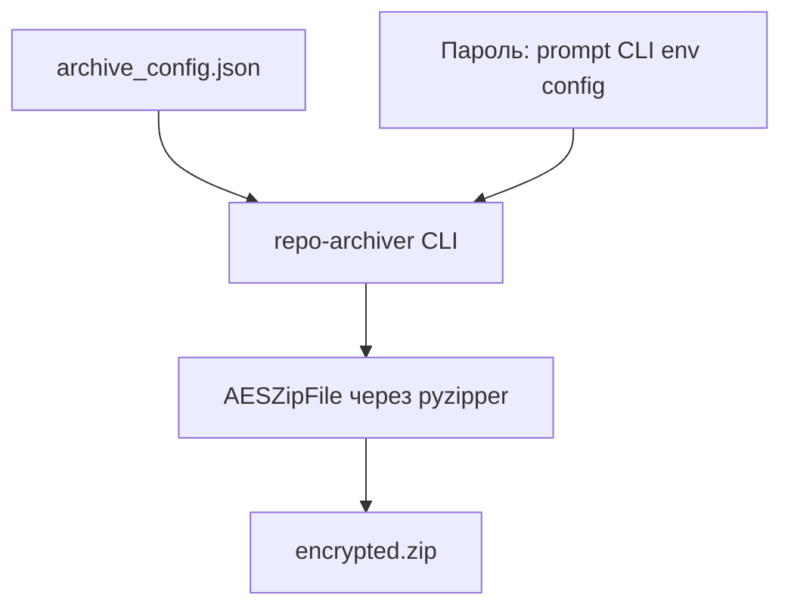

# repo-archiver

Инструмент для создания ZIP-архивов репозиториев с гибкой конфигурацией через JSON-файл.

## Возможности

- Архивация всего репозитория с историей Git
- Исключение внешних репозиториев и директорий по списку
- Исключение виртуальных окружений и временных файлов
- Принудительное включение директорий (игнорирует `.gitignore`)
- Настройка уровня и метода сжатия
- Поддержка нескольких `.gitignore` файлов
- Настоящее AES-256 шифрование ZIP через Python backend `pyzipper`
- Интерактивный ввод пароля с подтверждением

## Быстрое использование готового Docker-образа

Рекомендуемый сценарий для пользователя — запуск готового образа `medphisiker/repo-archiver:v0.0.1` из Docker Hub. Для этого ничего не нужно устанавливать в Python-окружение: достаточно иметь Docker и запустить контейнер.

Перед запуском контейнера в архивируемом репозитории нужно создать файл `archive_config.json`. Формат и пример конфигурации описаны в разделе [Конфигурация](README.md:160) данного `README.md`.

### Базовый запуск

```bash
docker run --rm \
  -v $(pwd):/repo \
  -v $(pwd):/output \
  medphisiker/repo-archiver:v0.0.1
```

Архив будет создан в директории, указанной в конфигурации, с именем по умолчанию `repo_archive.zip`.

### С AES-256 шифрованием через переменную окружения

```bash
docker run --rm \
  -v $(pwd):/repo \
  -v $(pwd):/output \
  -e ARCHIVE_PASSWORD="my-secret-password" \
  medphisiker/repo-archiver:v0.0.1
```

### С AES-256 шифрованием через интерактивный ввод

```bash
docker run --rm -it \
  -v $(pwd):/repo \
  -v $(pwd):/output \
  medphisiker/repo-archiver:v0.0.1 \
  --password-prompt \
  -c /repo/archive_config.json
```

Для интерактивного ввода контейнер должен запускаться с `-it`, иначе [`getpass.getpass()`](tools/repo-archiver/src/repo_archiver/cli.py:101) не сможет скрыть ввод.

### С кастомной конфигурацией

```bash
docker run --rm \
  -v $(pwd):/repo \
  -v $(pwd):/output \
  medphisiker/repo-archiver:v0.0.1 \
  -c /repo/my_custom_config.json
```

### Архивация другого репозитория

```bash
docker run --rm \
  -v /path/to/other/repo:/repo \
  -v $(pwd):/output \
  medphisiker/repo-archiver:v0.0.1 \
  -r /repo
```

## Путь разработчика

Этот раздел нужен, если вы хотите запускать инструмент локально через `uv`, разрабатывать его или собирать собственный Docker-образ.

### Установка из исходников

```bash
cd tools/repo-archiver
uv sync
```

### Сборка локального Docker-образа из исходников

Опубликованный образ из Docker Hub остаётся вариантом по умолчанию. Если нужно собрать локальный образ из текущих исходников:

```bash
cd tools/repo-archiver
docker build -t repo-archiver:local .
```

### Запуск через Python без Docker

#### Базовый запуск

```bash
cd tools/repo-archiver
uv run repo-archiver
```

#### С шифрованием через переменную окружения

```bash
cd tools/repo-archiver
ARCHIVE_PASSWORD="my-secret-password" \
uv run repo-archiver
```

#### С шифрованием через интерактивный ввод

```bash
cd tools/repo-archiver
uv run repo-archiver --password-prompt
```

При интерактивном вводе инструмент дважды запросит пароль. Пустой пароль и несовпадающее подтверждение приводят к ошибке.

#### С кастомной конфигурацией

```bash
cd tools/repo-archiver
uv run repo-archiver -c my_custom_config.json
```

#### Архивация другого репозитория

```bash
cd tools/repo-archiver
uv run repo-archiver -r /path/to/other/repo
```

### Использование без установки как Python-модуль

```bash
cd tools/repo-archiver
uv run python -m repo_archiver [OPTIONS]
```

### Использование как Python API

```python
from pathlib import Path
from repo_archiver import create_archive, load_config

config = load_config(Path("archive_config.json"))
files_added, total_size = create_archive(
    root_dir=Path("."),
    output_path=Path("archive.zip"),
    config=config,
    verbose=True,
    password=b"my-secret-password",
)

print(f"Добавлено файлов: {files_added}")
print(f"Общий размер: {total_size / 1024 / 1024:.2f} MB")
```

## Конфигурация

Создайте файл `archive_config.json` в корневой директории репозитория:

```json
{
  "compression": {
    "method": "deflated",
    "level": 9
  },
  "gitignore": {
    "enabled": true,
    "paths": [
      ".gitignore"
    ]
  },
  "encryption": {
    "enabled": false,
    "password_env": "ARCHIVE_PASSWORD"
  },
  "force_include": [
    "folder_to_include"
  ],
  "force_exclude": [
    ".venv",
    "node_modules",
    "vendor",
    "submodules",
    "dist",
    "build"
  ],
  "output": {
    "filename": "repo_archive.zip",
    "directory": "."
  }
}
```

### Параметры конфигурации

| Параметр | Описание | По умолчанию |
|----------|----------|--------------|
| `compression.method` | Метод сжатия: `stored`, `deflated`, `bzip2`, `lzma` | `deflated` |
| `compression.level` | Уровень сжатия (0-9 для `deflated`) | `9` |
| `gitignore.enabled` | Использовать ли паттерны `.gitignore` | `true` |
| `gitignore.paths` | Список путей к файлам `.gitignore` | `[".gitignore"]` |
| `encryption.enabled` | Включить ли AES-256 шифрование | `false` |
| `encryption.password_env` | Имя переменной окружения с паролем | `"ARCHIVE_PASSWORD"` |
| `force_include` | Директории для принудительного включения | `[]` |
| `force_exclude` | Директории для принудительного исключения | `[]` |
| `output.filename` | Имя выходного ZIP-файла | `repo_archive.zip` |
| `output.directory` | Директория для сохранения архива | `.` |

### Приоритет исключений

1. `force_exclude` — всегда исключает
2. `force_include` — всегда включает и игнорирует `.gitignore`
3. `gitignore` паттерны — исключают по файлам `.gitignore`

`force_include` поддерживает скрытые файлы и директории. Для dotfiles можно использовать как `.env`, так и `./.env`; оба варианта корректно работают и для путей вроде `./.config`.

## Шифрование

Инструмент поддерживает настоящее AES-256 шифрование ZIP. Приоритет источников пароля:

1. `--password-prompt` — интерактивный ввод с подтверждением
2. `-p` / `--password` — из командной строки
3. `--password-env` — из указанной переменной окружения
4. Конфигурация `encryption.password_env`

### Правила валидации

- пустой пароль запрещён;
- для [`--password-prompt`](tools/repo-archiver/src/repo_archiver/cli.py:84) требуется повторный ввод;
- архив, созданный с паролем, нельзя читать без правильного пароля.

## Тестирование

Навигация по тестам:
- индекс: [`docs/testing/test-map.md`](tools/repo-archiver/docs/testing/test-map.md:1)
- suite AES: [`docs/testing/suites/encryption-aes.md`](tools/repo-archiver/docs/testing/suites/encryption-aes.md:1)

Запуск тестов:

```bash
cd tools/repo-archiver
uv run python -m unittest discover -s tests -p "test_*.py"
```

## Как это работает



## Лицензия

MIT
