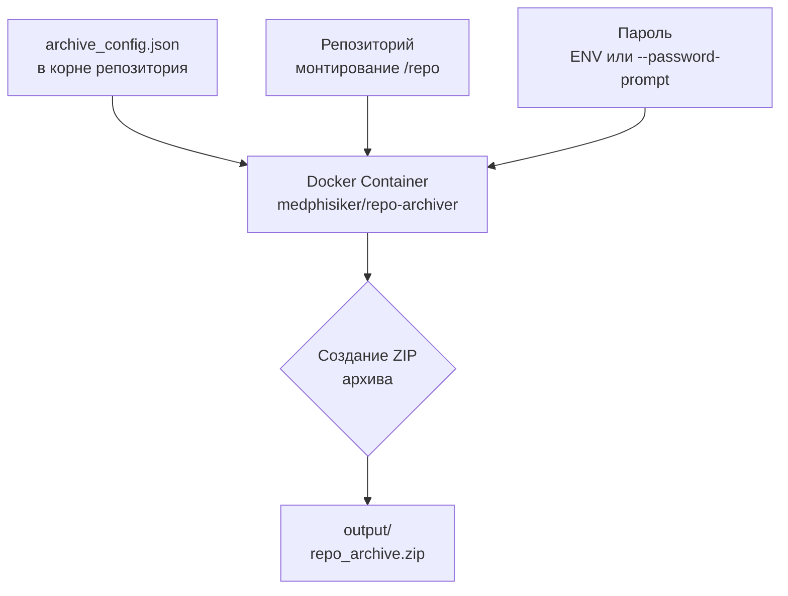

# repo-archiver

Инструмент для создания ZIP-архивов репозиториев с гибкой конфигурацией через JSON-файл.

## Быстрый старт

```bash
# Получить готовый образ
docker pull medphisiker/repo-archiver:v0.0.1

# Базовая архивация текущего репозитория
# (полные примеры в разделе "🐳 Использование Docker")
docker run --rm \
  -v $(pwd):/repo \
  -v $(pwd):/output \
  medphisiker/repo-archiver:v0.0.1
```

Архив будет создан в директории `/output` с именем, указанным в конфигурации (по умолчанию `repo_archive.zip`).

## Возможности

- Архивация всего репозитория с историей Git
- Исключение внешних репозиториев и директорий по списку
- Исключение виртуальных окружений и временных файлов
- Принудительное включение директорий (игнорирует .gitignore)
- Настройка уровня и метода сжатия
- Поддержка нескольких .gitignore файлов
- Шифрование архива паролем

## Использование Docker

### Базовый запуск

```bash
docker run --rm \
  -v $(pwd):/repo \
  -v $(pwd):/output \
  medphisiker/repo-archiver:v0.0.1
```

### С шифрованием (переменная окружения)

```bash
docker run --rm \
  -v $(pwd):/repo \
  -v $(pwd):/output \
  -e ARCHIVE_PASSWORD="my-secret-password" \
  medphisiker/repo-archiver:v0.0.1
```

### С шифрованием (интерактивный ввод пароля)

**Важно:** Флаг `--password-prompt` должен указываться **перед** опцией `-c`, иначе он не будет распознан.

```bash
docker run --rm -it \
  -v $(pwd):/repo \
  -v $(pwd):/output \
  medphisiker/repo-archiver:v0.0.1 \
  --password-prompt \
  -c /repo/archive_config.json
```

При запуске контейнер запросит пароль для шифрования архива. Ввод пароля не отображается в терминале (режим инкогнито).

### С кастомной конфигурацией

```bash
docker run --rm \
  -v $(pwd):/repo \
  -v $(pwd):/output \
  medphisiker/repo-archiver:v0.0.1 \
  -c /repo/my_custom_config.json
```

### Архивация другого репозитория

```bash
docker run --rm \
  -v /path/to/other/repo:/repo \
  -v $(pwd):/output \
  medphisiker/repo-archiver:v0.0.1 \
  -r /repo
```

## Конфигурация

Создайте файл `archive_config.json` в корневой директории репозитория:

```json
{
  "compression": {
    "method": "deflated",
    "level": 9
  },
  "gitignore": {
    "enabled": true,
    "paths": [
      ".gitignore"
    ]
  },
  "encryption": {
    "enabled": false,
    "password_env": "ARCHIVE_PASSWORD"
  },
  "force_include": [
    "folder_to_include"
  ],
  "force_exclude": [
    ".venv",
    "node_modules",
    "vendor",
    "submodules",
    "dist",
    "build"
  ],
  "output": {
    "filename": "repo_archive.zip",
    "directory": "."
  }
}
```

### Параметры конфигурации

| Параметр | Описание | По умолчанию |
|----------|----------|--------------|
| `compression.method` | Метод сжатия: `stored`, `deflated`, `bzip2`, `lzma` | `deflated` |
| `compression.level` | Уровень сжатия (0-9 для deflated) | `9` |
| `gitignore.enabled` | Использовать ли паттерны .gitignore | `true` |
| `gitignore.paths` | Список путей к файлам .gitignore | `[".gitignore"]` |
| `encryption.enabled` | Включить ли шифрование паролем | `false` |
| `encryption.password_env` | Имя переменной окружения с паролем | `"ARCHIVE_PASSWORD"` |
| `force_include` | Директории для принудительного включения (игнорируют .gitignore) | `[]` |
| `force_exclude` | Директории для принудительного исключения (всегда исключаются) | `[]` |
| `output.filename` | Имя выходного ZIP-файла | `repo_archive.zip` |
| `output.directory` | Директория для сохранения архива | `.` |

### Приоритет исключений

1. **force_exclude** — всегда исключает (высший приоритет)
2. **force_include** — всегда включает (игнорирует .gitignore)
3. **gitignore паттерны** — исключает по паттернам из .gitignore

## Шифрование

Инструмент поддерживает шифрование архива паролем. Приоритет источников пароля (от высшего к низшему):

1. `--password-prompt` — интерактивный ввод
2. `-p/--password` — из командной строки
3. `--password-env` — из указанной переменной окружения
4. Конфигурация (`encryption.password_env`)

### ⚠️ Важные замечания

**Порядок аргументов командной строки:**
Все флаги (например, `--password-prompt`) должны указываться **перед** опцией `-c` с путём к конфигурации. В противном случае они не будут распознаны.

✅ **Правильно:**
```bash
docker run --rm -it \
  -v $(pwd):/repo \
  -v $(pwd):/output \
  medphisiker/repo-archiver:v0.0.1 \
  --password-prompt \
  -c /repo/archive_config.json
```

❌ **Неправильно** (флаг после `-c` не распознаётся):
```bash
docker run --rm -it \
  -v $(pwd):/repo \
  -v $(pwd):/output \
  medphisiker/repo-archiver:v0.0.1 \
  -c /repo/archive_config.json \
  --password-prompt
```

**Требования к TTY:**
Для интерактивного ввода пароля контейнер должен запускаться с флагами `-it` (интерактивный режим + TTY). Без TTY `getpass.getpass()` не сможет скрыть ввод пароля.

## Примеры конфигураций

### Архивация проекта с исключением node_modules и .venv

```json
{
  "force_exclude": [".venv", "node_modules", "dist"],
  "force_include": [],
  "output": {
    "filename": "project_archive.zip"
  }
}
```

### Архивация с историей Git, но без внешних подмодулей

```json
{
  "gitignore": {
    "enabled": true,
    "paths": [".gitignore"]
  },
  "force_exclude": ["submodules", "vendor"],
  "force_include": [".git"]
}
```

### Полная архивация для бэкапа

```json
{
  "gitignore": {
    "enabled": true,
    "paths": [".gitignore"]
  },
  "force_include": [".git"],
  "force_exclude": [],
  "compression": {
    "method": "deflated",
    "level": 9
  },
  "encryption": {
    "enabled": true,
    "password_env": "ARCHIVE_PASSWORD"
  }
}
```

## Как это работает



## 🛠️ Альтернативные способы

### Установка из исходников

```bash
cd tools/repo-archiver
uv pip install -e .
```

### Использование без установки

```bash
uv run python -m repo_archiver [OPTIONS]
```

### Как Python-модуль

```python
from pathlib import Path
from repo_archiver import create_archive, load_config

# Загрузить конфигурацию
config = load_config("archive_config.json")

# Создать архив
files_added, total_size = create_archive(
    root_dir=Path("."),
    output_path=Path("archive.zip"),
    config=config,
    verbose=True
)

print(f"Добавлено файлов: {files_added}")
print(f"Общий размер: {total_size / 1024 / 1024:.2f} MB")
```

## Лицензия

MIT
